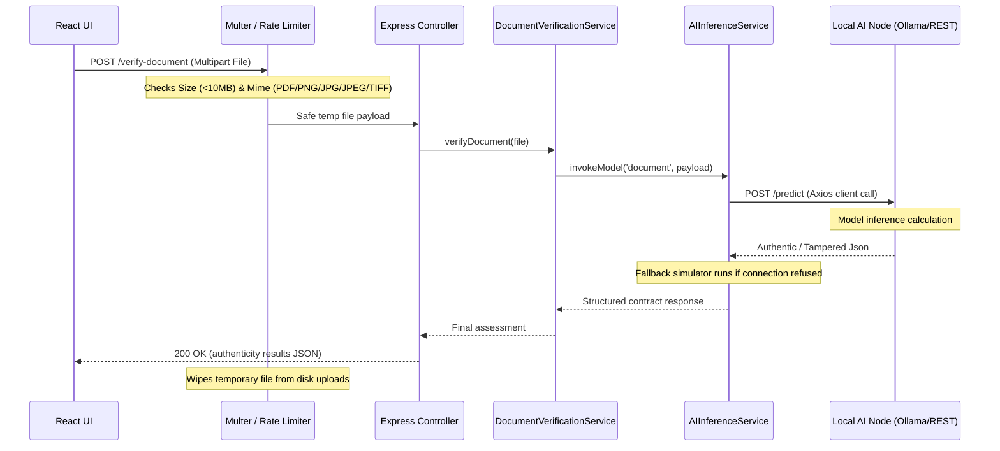
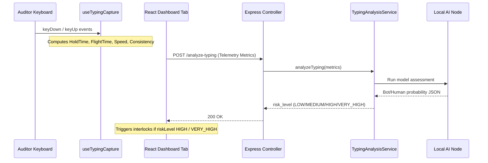

# AI Integration Architecture

This document describes the software design, sequence dynamics, and architectural flow of the VisiGuard AI local cybersecurity coprocessor.

---

## Modular Component Design

All AI features reside in their own isolated folders, decoupled from the core application logic. This facilitates quick removal or service migration.

```text
apps/backend/src/ai/
├── config/             # Environment parameters
├── controllers/        # HTTP entry controllers
├── middlewares/        # Upload validators & rates
├── routes/             # Route mapping binds
├── services/           # Inference execution pipeline
└── utils/              # Structured JSON event logger
```

```text
apps/frontend/src/ai/
├── components/         # Interactive UI elements
├── hooks/              # Telemetry capture hooks
└── services/           # Axios network endpoints
```

---

## Data Flow Diagrams

### Document Authenticity Verification Flow



---

## typing Dynamics sequence Flow


