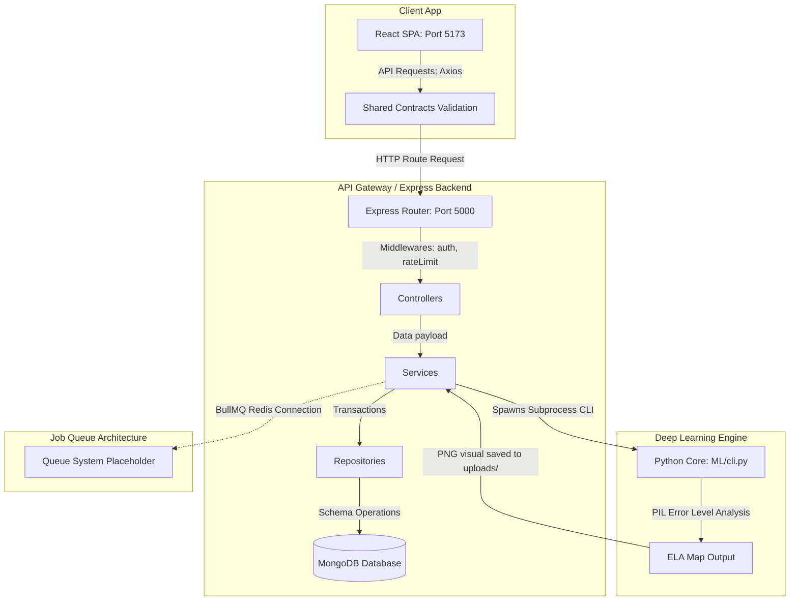

# VisiGuard AI - Technical Architecture Guide

This document describes the software architecture of VisiGuard AI, mapping execution paths and components.

---

## Architectural Workflow Overview

---

## Layers Definition

### 1. Routes Layer
* **Location**: `apps/backend/src/routes/`
* **Purpose**: Map HTTP verbs and URI paths to their controllers.
* **Responsibility**: Validate rate-limiting configurations, handle file multipart intercepts, and check authentication headers.
* **Dependencies**: Express, Multer, RateLimiter, AuthMiddleware.

### 2. Controllers Layer
* **Location**: `apps/backend/src/controllers/`
* **Purpose**: Bridge client requests and internal services.
* **Responsibility**: Extract body payloads, execute Zod schemas, dispatch jobs to service engines, and return standard JSON formats.
* **Inputs/Outputs**: HTTP Requests in, JSON response out.

### 3. Services Layer
* **Location**: `apps/backend/src/services/`
* **Purpose**: Orchestrate core business logic.
* **Responsibility**: Call external Python subprocesses, encrypt user passwords, construct event monitors, and orchestrate storage providers.
* **Future Extension**: Modular services allow direct microservices migration (e.g. migrating ELA to a separate flask/fastapi container).

### 4. Repositories Layer
* **Location**: `apps/backend/src/repositories/`
* **Purpose**: Decouples Mongoose database transactions.
* **Responsibility**: Query documents, filter metrics, and update records.

---

## Shared Contracts
* **Location**: `shared/contracts/`
* **Purpose**: Avoid interface drift. Zod schemas are shared to guarantee that request models sent from React match expectations on Express.
